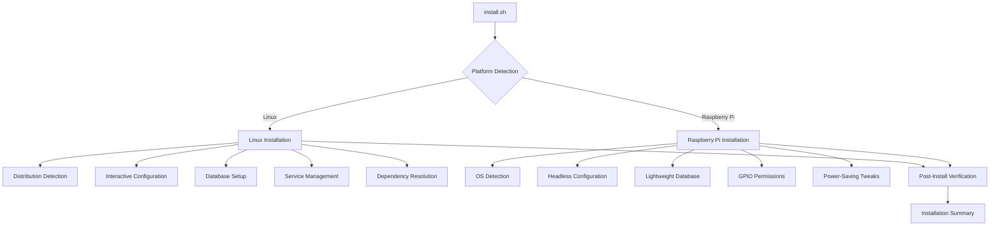

# Installation System Design

## Overview
This document outlines the design for a robust, cross-platform installation system for the 3mm application. The system will support two distinct deployment methods via a unified installation script: Linux (PC/Server) and Raspberry Pi (Zero W/2W).

## Architecture Diagram

## Components

### 1. Unified Installation Script (`install.sh`)
- Single entry point with auto-detection of target platform
- Idempotent operations (safe to re-run)
- Configuration persistence (JSON/YAML)
- Rollback capability
- Silent mode (non-interactive with pre-configured vars)

### 2. Platform Detection
- Linux distribution detection (Debian/Ubuntu, RHEL/CentOS, Arch, etc.)
- Raspberry Pi OS detection (32/64-bit)
- Hardware validation (CPU/ram/storage)

### 3. Configuration Options
- **Linux:**
  - Hostname assignment
  - Static/dynamic IP configuration
  - Network interface selection
  - Firewall rules (ufw/iptables)

- **Raspberry Pi:**
  - Wi-Fi/ethernet setup
  - Hostname and mDNS (Avahi)
  - Low-resource optimizations
  - GPIO/peripheral access permissions

### 4. Database Backend Selection
- PostgreSQL (version selection, secure auth, optimized config)
- SQLite (for lightweight deployments)
- MySQL/MariaDB (optional)

### 5. Service Management
- systemd/init.d integration
- Auto-start configuration
- Logging setup

### 6. Dependency Resolution
- Python and library dependencies
- Build tools
- Offline mode support

### 7. Post-Install Verification
- Health checks
- Connectivity tests
- Configuration validation

### 8. Uninstall Script (`uninstall.sh`)
- Clean removal of all components
- Configuration backup option
- Database cleanup

### 9. Documentation
- Prerequisites (minimal OS versions, hardware reqs)
- Customization options (environment variables, flags)
- Troubleshooting common issues

## Implementation Plan

### Phase 1: Core Installation Script
1. Create `install.sh` with platform detection
2. Implement basic configuration options
3. Add logging and error handling

### Phase 2: Platform-Specific Features
1. Linux distribution detection and configuration
2. Raspberry Pi OS detection and optimizations
3. Database backend selection and setup

### Phase 3: Advanced Features
1. Service management integration
2. Dependency resolution
3. Post-install verification

### Phase 4: Testing and Documentation
1. Test on target platforms
2. Create uninstall script
3. Write comprehensive documentation

## Security Considerations
- Root privilege escalation with minimal scope
- Database credentials generated via `pwgen`
- Firewall rules restricted to necessary ports
- Optional TLS setup (Let’s Encrypt or self-signed certs)

## Error Handling
- Graceful degradation for non-critical failures
- Specific error codes for debugging
- Automatic retry for transient failures

## Validation Plan
- Test matrices for Linux distributions (Ubuntu, Debian, CentOS, Arch)
- Raspberry Pi OS testing (Lite/Full, 32/64-bit)
- CI/CD pipeline for automated testing
