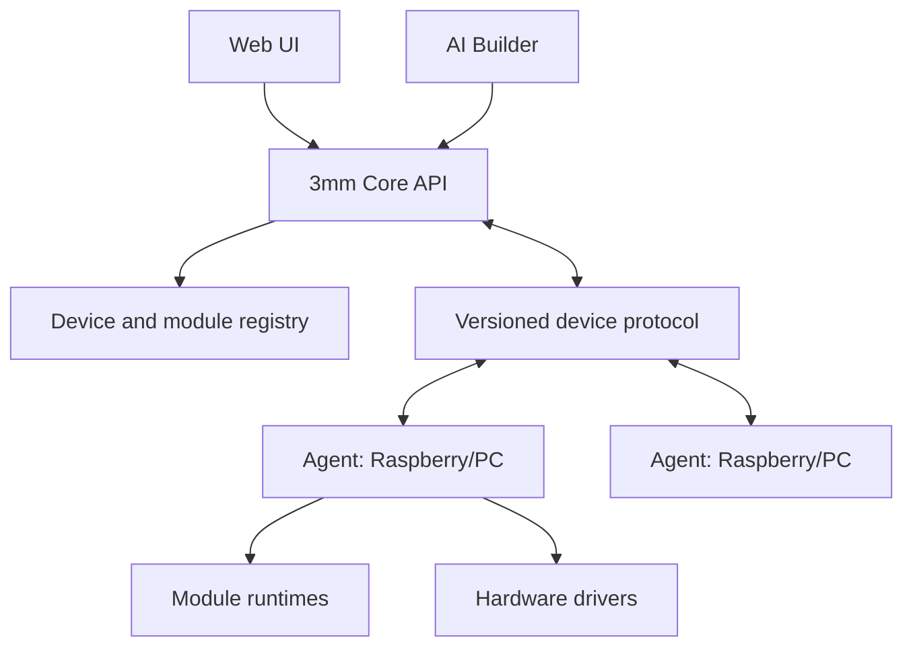

# 3mm Architecture Plan

Status: active; initial architecture approved on 2026-08-09
Scope: transformation of the existing 3mm repository into a web-based edge device platform  
Primary targets: Linux PC/server, Raspberry Pi 3B/4/5, Raspberry Pi Zero 2 W and future compatible devices

## 1. Product definition

3mm is a web-based platform for discovering, pairing, configuring and operating edge devices. A central Core provides the user interface, security, configuration and AI-assisted building tools. A lightweight Agent runs on each managed device and executes only explicitly installed modules and approved actions.

3mm is not a Linux distribution and does not replace Raspberry Pi OS. It is an application platform installed on top of a supported Linux system.

The platform must support these primary use cases:

- centralized management of Raspberry Pi and Linux devices;
- local, reliable execution of GPIO, media, sensor and automation workloads;
- installation and lifecycle management of modules;
- dashboards and user-facing applications assembled from modules;
- AI-assisted creation of configurations, automations and new modules;
- operation on a single Raspberry Pi as well as migration to a more powerful PC;
- one universal installation image with first-boot role selection;
- headless network and role provisioning from a phone browser;
- continued Agent operation during a temporary loss of connection to Core.

## 2. Architectural principles

1. Core knows capabilities and contracts, not concrete module names.
2. Core and Agent communicate through a versioned protocol.
3. Hardware access is isolated behind drivers and capability interfaces.
4. Modules declare all requirements and permissions in a manifest.
5. AI output is treated as untrusted input until validated and approved.
6. A temporary network failure must not stop an already deployed local workload.
7. Every material change must be auditable and reversible.
8. The laptop development environment and real Raspberry Pi environment use the same contracts and tests.
9. SQLite is the default for development and small installations; database-specific behavior is forbidden in domain code.
10. A clean installation must not depend on credentials, paths or services from a developer's machine.
11. Local operation and already installed modules must not depend on an active AI subscription or cloud availability.
12. A Hub is also a managed local device and therefore always runs its own Agent.

## 3. Target system

### 3.1 3mm Core

Core owns:

- authentication, users, roles and permissions;
- device registry and pairing;
- module catalog and trusted package metadata;
- desired state for each device;
- configuration version history;
- command dispatch and result tracking;
- dashboards, menus and user interface composition;
- audit log and system-wide observability;
- backup and restore;
- AI request orchestration, validation and approval workflow.

Core does not directly access remote GPIO or assume that a named module exists.

### 3.2 3mm Agent

Agent is a separate lightweight Python service with no Vue frontend and minimal dependencies. It owns:

- stable device identity;
- secure pairing and authentication to Core;
- hardware and operating-system inventory;
- periodic heartbeat and health report;
- local module installation and lifecycle;
- desired-state reconciliation;
- local event and command execution;
- local configuration cache;
- bounded log buffering while offline;
- safe update, health check and rollback;
- enforcement of module permissions.

The Agent initiates outbound connections to Core. Core must not require SSH access to devices for normal operation.

### 3.3 3mm Module

A module is an installable unit that may target one or more runtimes:

- `core`: backend routes, services and optional frontend UI;
- `agent`: local service, driver or automation capability;
- `ui`: frontend components only;
- `bundle`: coordinated Core, Agent and UI components.

Each module has an immutable versioned package and a manifest containing at least:

- stable module ID, name and semantic version;
- supported 3mm protocol and runtime versions;
- target runtimes and supported CPU architectures;
- entry points;
- declared capabilities provided and consumed;
- configuration schema and defaults;
- permissions;
- dependencies and conflicts;
- health check;
- data migrations;
- update and rollback metadata;
- integrity hash and package signature metadata.

### 3.4 Hardware driver layer

Business modules never import Raspberry-specific GPIO libraries directly. They use interfaces such as:

- `DigitalInput`;
- `DigitalOutput`;
- `PWMOutput`;
- `I2CBus`;
- `SPIBus`;
- `SerialPort`;
- `Camera`;
- `AudioOutput`;
- `VideoOutput`.

Initial driver implementations:

- `mock`: deterministic laptop development and automated testing;
- `linux`: generic OS information and process controls;
- `raspberrypi`: GPIO and Raspberry-specific peripherals, added when hardware is available.

### 3.5 Device roles

All supported devices use one installation image. The user selects a product-facing mode during provisioning, while the runtime remains composed from the same Core and Agent services.

| User-facing mode | Runtime services | Behavior |
|---|---|---|
| Standalone | Core + local Agent | Operates one device and initially hides fleet-management complexity |
| Hub / Server | Core + local Agent | Operates its own hardware and accepts additional paired Agents |
| Node / Client | Agent | Connects to a selected Hub and continues approved local workloads while disconnected |

Standalone is a Hub preset, not a separate software edition. Enabling additional devices later must not require reinstallation. A Node may be promoted to Hub without losing its stable device identity or local module data.

### 3.6 Headless provisioning

An unprovisioned device runs a minimal setup service and exposes a temporary Wi-Fi access point plus captive portal. The setup flow configures:

- interface and network credentials;
- locale, device name and administrator credentials;
- Standalone, Hub or Node mode;
- Hub discovery and pairing bootstrap for a Node;
- recovery behavior when the selected network cannot be reached.

The temporary setup network is open so a new owner can reach it without first
discovering a device-specific password. It exists only while the device is
unprovisioned or after an authenticated/physical network reset, exposes only
the captive setup portal, and shuts down after successful provisioning. This
deliberately trades nearby-network confidentiality during setup for simple
recovery; the portal must therefore never expose the normal application or
stored settings. Failed network configuration rolls back to setup mode instead
of leaving the device unreachable. A shared fleet-wide setup credential is
forbidden.

Submitted Wi-Fi credentials cross a root-owned local Unix-socket boundary only
in memory. NetworkManager stores the selected network secret in its root-only
system connection profile so the device can reconnect after reboot. The secret
is not copied into the provisioning journal, Core database, diagnostics,
environment configuration, command arguments or logs.

Network management is behind an adapter so the state machine and portal are testable on a laptop. Raspberry-specific NetworkManager, access-point and captive-portal integration belongs in the platform adapter, not in the provisioning domain logic.

## 4. Core-Agent protocol

The protocol is transport-independent at the domain level. The first implementation will use HTTPS REST for pairing/bootstrap and WebSocket for live bidirectional messages. Long polling remains a fallback for restricted networks.

### 4.1 Required flows

1. Core creates a short-lived pairing code.
2. Agent presents its identity, pairing code and public key.
3. Core displays the pending device for explicit approval.
4. Core issues device credentials.
5. Agent connects and sends inventory plus current state.
6. Core responds with desired state.
7. Agent reconciles the difference and reports a structured result.
8. Both sides track monotonic message IDs and acknowledgements.

### 4.2 Message envelope

Every protocol message contains:

- protocol version;
- message ID;
- device ID;
- type;
- creation timestamp;
- correlation ID when responding to another message;
- payload;
- optional expiry and idempotency key.

Initial message types:

- `agent.hello`;
- `agent.inventory`;
- `agent.heartbeat`;
- `state.desired`;
- `state.reported`;
- `command.request`;
- `command.result`;
- `event.publish`;
- `logs.batch`;
- `module.install`;
- `module.update`;
- `module.remove`;
- `agent.update`.

### 4.3 Offline behavior

- Agent continues running the last valid deployed configuration.
- Expiring remote commands are not executed after their expiry.
- Events and logs are buffered within configured disk limits.
- Desired-state changes are versioned and reconciled after reconnect.
- Conflicts are resolved by explicit policy; they are never silently overwritten.

## 5. AI architecture

AI work is separated into increasing trust levels:

### Level 1: Explain

AI reads inventory, manifests, schemas and logs, then explains or recommends. It cannot change the system.

### Level 2: Configure

AI produces a typed configuration or automation plan conforming to an existing schema. The system validates it and displays a diff before approval.

### Level 3: Compose

AI connects existing capabilities into a workflow. Generated workflows use a restricted declarative format, not arbitrary Python.

### Level 4: Build

AI generates a new module in a dedicated build workspace. Static checks, tests, manifest validation and package signing happen before installation. Generated code is never loaded directly into the Core process.

The Builder uses a hybrid capability-based pipeline rather than asking a model
to create an entire extension from an empty scaffold:

1. AI converts the user's description into a typed capability plan.
2. Core validates requested capabilities, permissions and target devices.
3. Deterministic generators create the trusted lifecycle, configuration,
   editor, storage, API and packaging foundation.
4. AI may customize presentation and extension-specific behavior without
   replacing capability security boundaries.
5. The exact source is compiled and smoke-tested in isolation.
6. Only the reviewed artifact hash may be installed.
7. Later changes repair the existing project and increment its version instead
   of regenerating it from zero.

Common capabilities begin with live timers, forms, HTTP data, key-value
settings, CRUD records, lists, metrics and GPIO input. A GPIO dashboard widget
never accesses hardware from Vue or Core. Its required data path is:

`DigitalInput driver → Agent capability → authenticated Core state/event boundary → compiled widget`

The widget editor selects a paired device and declared pin plus presentation
settings. The Agent enforces hardware permissions, while the UI distinguishes
HIGH, LOW, stale, offline and error states. This flow must work against the
deterministic mock driver before using a physical Raspberry GPIO adapter.

### Level 5: Operate

AI may execute pre-approved, narrowly scoped operations. Destructive or security-sensitive operations always require explicit approval.

### 5.1 AI service and billing boundary

AI is optional and is not part of the local runtime availability boundary. Core, Agent, installed modules and deployed automations continue operating without an AI account, available credit or internet access.

The recommended commercial model combines:

- a site/service subscription for optional cloud features, updates and support;
- an included limited AI allowance;
- prepaid top-up credit for additional AI jobs;
- an advanced bring-your-own-provider-key mode;
- explicit project budgets or quotations for unusually large module builds.

Users approve a maximum job budget after seeing the proposed plan and estimated range. The platform reserves that maximum and settles recorded usage after completion. Provider tokens and prices remain internal implementation details; user-facing estimates use stable product credits or currency.

AI requests using platform credentials pass through a provider-independent gateway. Provider keys are never deployed to managed Raspberry Pi devices. Every job records its estimate, approved limit, actual usage, artifact hashes and outcome. A generated artifact may be deployed to all authorized devices owned by the same customer without paying to generate identical code again.

Cost control follows the AI trust levels: prefer schema configuration, then declarative composition, and generate new code only when registered capabilities cannot satisfy the request. Model routing, template reuse, incremental diffs, bounded repair attempts and cached validated artifacts are mandatory controls.

## 6. Security model

- No credentials or private keys are committed to Git.
- Device credentials are unique, revocable and rotatable.
- Pairing codes are single-use and short-lived.
- All non-local communication is authenticated and encrypted.
- Modules receive deny-by-default permissions.
- Core modules and Agent modules run outside the main Core API process when they execute untrusted or generated code.
- File, network, process and hardware access are mediated by runtime policy.
- Package integrity is verified before installation.
- Secrets are referenced by opaque IDs and are never included in AI prompts, logs or module configuration exports.
- Audit records capture actor, action, target, result and correlation ID.
- Database migrations and updates require a backup or a verified rollback path.

The existing Python `extension_sandbox.py` is not considered a security boundary. Process/container isolation and operating-system permissions are required for untrusted code.

## 7. Data model additions

The existing user, role, session, audit, display and extension data is retained where practical. New primary entities:

- `Device`;
- `DeviceCredential`;
- `DevicePairingRequest`;
- `DeviceInventorySnapshot`;
- `DeviceHeartbeat`;
- `ModulePackage`;
- `ModuleInstallation`;
- `DesiredStateRevision`;
- `ReportedStateRevision`;
- `Command`;
- `CommandResult`;
- `DeviceEvent`;
- `Automation`;
- `SecretReference`;
- `AiJob`;
- `AiUsageLedgerEntry`;
- `AiBudgetReservation`.

High-frequency telemetry must not be stored indefinitely in the main relational tables. Retention and aggregation policies are mandatory.

## 8. Laptop development environment

No Raspberry Pi is required for the first phases. The laptop environment will run:

- one Core backend;
- one Vue frontend;
- SQLite by default;
- two or more Agent processes with separate data directories;
- mock hardware profiles representing Pi Zero 2 W, Pi 3B and generic Linux PC;
- deterministic simulated GPIO changes and sensor readings;
- optional network disconnect/reconnect simulation.

Example logical topology:

| Process | Identity | Simulated hardware |
|---|---|---|
| Core | `3mm-core-dev` | Linux laptop |
| Agent 1 | `mock-pi3-01` | Raspberry Pi 3B, GPIO |
| Agent 2 | `mock-zero2-01` | Raspberry Pi Zero 2 W, GPIO + sensor |
| Agent 3 | `mock-linux-01` | Generic Linux, no GPIO |

Hardware acceptance testing will be added when a Raspberry Pi becomes available; it does not block protocol, UI, registry, state reconciliation or AI configuration development.

## 9. Migration strategy for the existing repository

The transformation is incremental. We do not rewrite the whole application in one step.

### Keep and stabilize

- FastAPI and Vue 3 foundations;
- users, roles, permissions, sessions and audit model;
- dashboard/display editor where compatible;
- multilingual support;
- manifest and AI Builder concepts;
- SQLAlchemy and Alembic.

### Replace or redesign

- mocked Main Server device list;
- mocked deploy/update flow;
- direct in-process loading of arbitrary extension Python;
- machine-specific database configuration;
- duplicated temporary extension directories;
- unversioned extension protocol;
- claims in documentation that are not backed by executable behavior.

### Quarantine until reviewed

- marketplace installation of remote packages;
- AI-generated backend execution;
- destructive extension cleanup and table deletion;
- automatic dependency installation with elevated privileges.

## 10. Initial acceptance scenario

The architecture is proven when all of the following work on one laptop:

1. Core starts from a clean checkout with one documented command.
2. Two mock Agents start with separate identities.
3. Each Agent appears as pending and is paired explicitly.
4. Core shows real inventory and heartbeat data from each Agent.
5. A mock GPIO module is deployed to one Agent.
6. A setting change creates a new desired-state revision.
7. Agent applies it and reports the matching state revision.
8. Simulated GPIO events appear in Core with correlation IDs.
9. Agent continues its local behavior while Core is stopped.
10. Agent reconnects, flushes bounded events and reconciles state.
11. A failed module update rolls back automatically.
12. Audit log explains who changed what and what happened.
